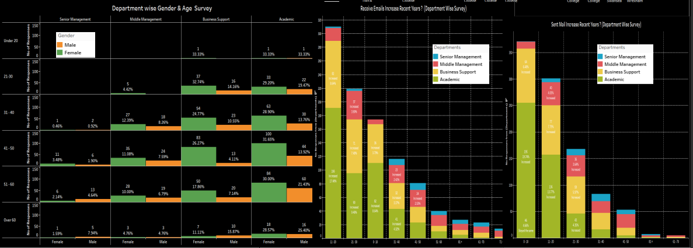
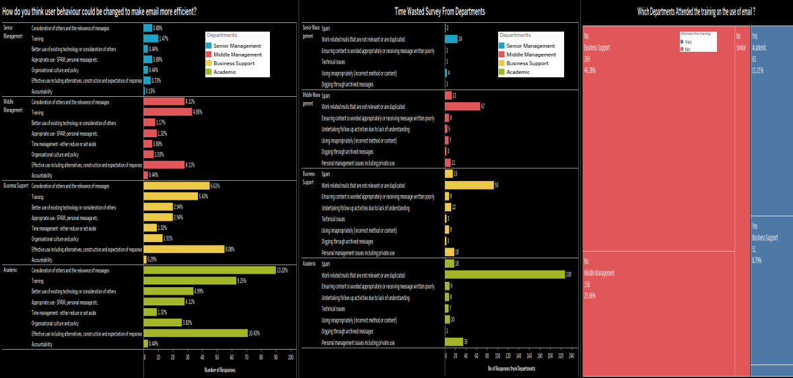
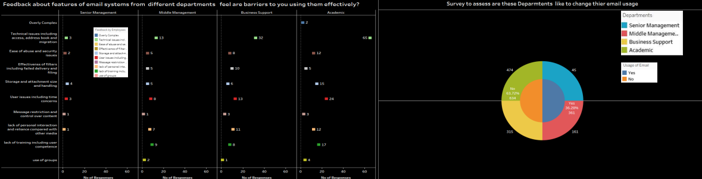

# Problem-Detection-and-Solution

**Project Title:** Data-Driven Problem Detection and Solution Recommendation for Assigned Data

**Project Description:**

The objective of this project is to analyze an assigned dataset and identify potential problems through statistical analysis. Based on the observed issues, the project aims to propose effective solutions to mitigate or eradicate the identified problems.

**Project Outline:**

Data Assignment: Receive an assigned dataset from the project stakeholders, which may contain various types of data, such as numerical, categorical, or textual information.

Data Exploration and Descriptive Statistics: Perform exploratory data analysis to gain a comprehensive understanding of the dataset. Calculate descriptive statistics, such as measures of central tendency, dispersion, and distributions, to summarize the key characteristics of the data.

**Problem Detection:**

Utilize statistical techniques and visualizations to identify any anomalies, inconsistencies, or patterns that indicate potential problems within the dataset. Thoroughly examine the data to uncover any irregularities, outliers, missing values, or data integrity issues.

Problem Analysis and Root Cause Determination: Analyze the detected problems to determine their root causes. Investigate possible reasons behind the identified issues, considering factors such as data collection processes, data entry errors, data processing pipelines, or inherent limitations of the dataset.

**Solution Recommendation:**

Based on the analysis of the identified problems, propose appropriate solutions to address or resolve each issue. Develop practical and actionable recommendations that can be implemented to rectify the problems and improve the overall quality and reliability of the data.

Documentation and Reporting: Document the entire process, including the dataset exploration, problem detection methodology, problem analysis, and recommended solutions. Prepare a comprehensive report summarizing the findings and recommendations in a clear and concise manner.

**Presentation and Stakeholder Engagement:**

Deliver a presentation to the project stakeholders, highlighting the detected problems, the root causes behind them, and the proposed solutions. Engage in discussions with the stakeholders to ensure a thorough understanding of the issues and to validate the recommended solutions.

**Result**

Overall I concluded that as I found a problem in graph (3,4) where Senior and Middle Management are not sending or receiving emails,So we have used different questions and visualize the feedback of employees of from Senior and Middle Management  as some of employees from these departments think that email waste time,some of employees feels that few features 
of email systems are barrier to using them effectively,and the main thing I analyzed that most 
employees from these two departments have not been participating in a training in comparison to other 
departments,Due to this they are not sending or receiving email.And  in last question the employees 
from Senior and Middle Management are willing to change their email usage,So I analyzed if they will get 
proper training where attendance is mandatory then this problem can be solved easily
